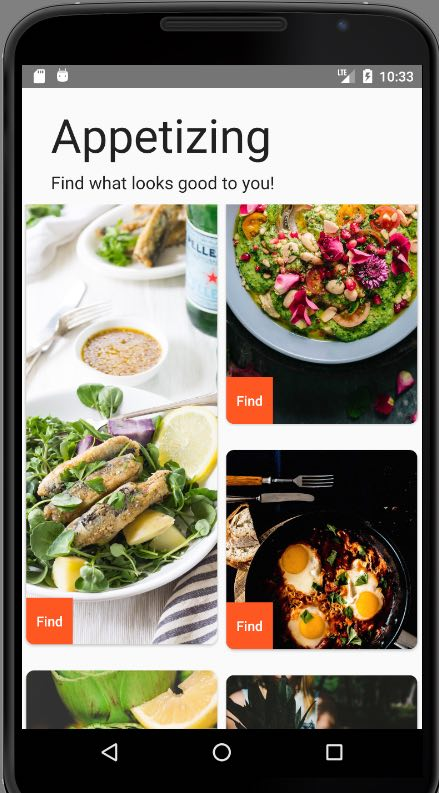

# Appetizing
- Android capstone project for Epicodus coding school.


Have you ever been hungry but didn't know what you wanted to eat?

Have you ever been inspired by beautiful photography?

hungry + photographic inspiration =  Appetizing!

## What is Appetizing

Appetizing is a stream of category=food photography from the UnSplash API.  

The user is hungry and undecided. As they scroll through the beautiful hi-res photos, their visual senses will engage to help them make a decision on what to eat.

Once they have decided, they can click on a photo and it will generate a Yelp list of restaurants near them that serve that type of food.



## Planning

#### Phase 1

- [x] Test UnSplash API in browser. Return Json.
- [x] Create UnSplashService class and return LogCat response.
- [x] transform response into Picture object
- [x] Create Recycler View for UnSplash on main
- [x] Create Button on View Item To Search local
- [x] Button intent moves to RestaurantActivity
- [ ] Style Content


# Technologies

Java, Android Studio

## Prerequisites

You will need the following software properly installed on your computer.

* [Android Studio 2.3.2](https://developer.android.com/studio/index.html)

You'll also need an API Client ID token from UnSplash. [You can get it here](https://unsplash.com/login)

They will ask for your App name but you don't need to have one and will still get a API token. You are limited to 50 calls per hour.


## Installation

Perform the following steps to setup the app to run in Android Studio.

* #### Get the UnSplash API Client ID. [You can get it here](https://unsplash.com/login)

* #### In Android Studio, open the Terminal. At the prompt, navigate into your "AndroidStudioProjects" folder.


Once there, run the following command.
```
git clone https://github.com/XiXiaPdx/XiXiaAndroidProject.git
```
*  #### Navigate into the project folder
```
cd XiXiaAndroidProject
```
*  #### create file gradle.properties to hold your UnSplash Client ID token. I'm using Atom.
```
atom gradle.properties
```
* #### insert the following text into gradle.properties.

```
org.gradle.jvmargs=-Xmx1536m
UnSplashId = "Your Client ID From UnSplash Goes Here!!!"

```
* #### Android Studio should prompt you to Gradle Sync.  At this point, a gradle sync should clear any warnings and the whole project will gradle build.

* #### Run the app in the emulator. I am emulating a Nexus 6.

### Login Details

email is "perry@me.com"
password is "hello"

The Login Activity is not finalized. Currently, it does show form validation for the purpose of the assignment.


## Further Exploration


## License

Copyright (c) 2017 Xi Xia. This software is licensed under the MIT license.
