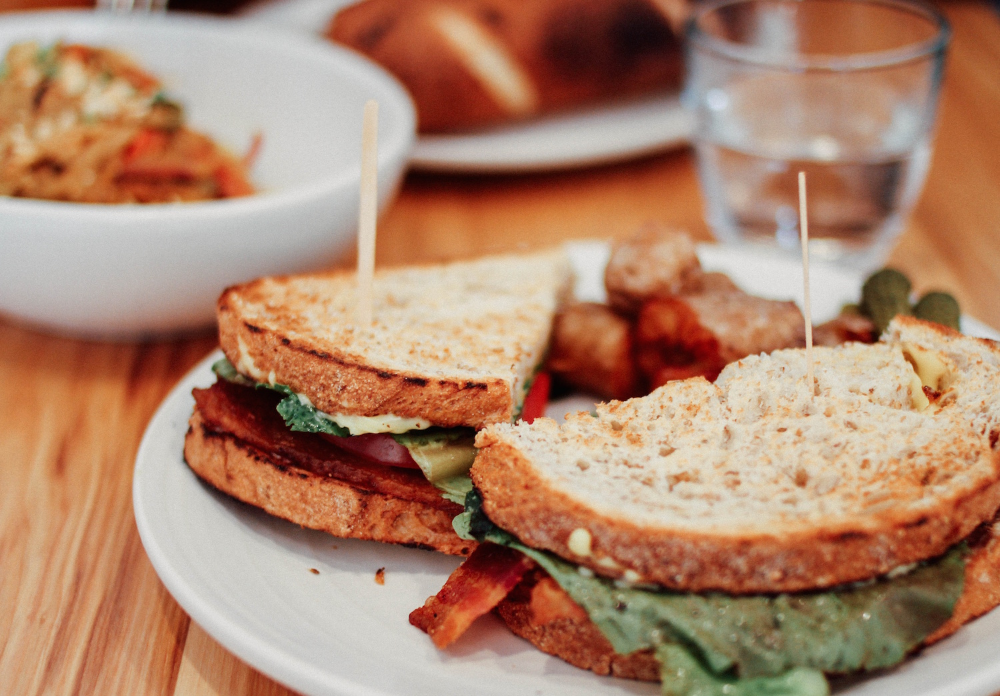

# Appetizing
- Android capstone project for Epicodus coding school.



Have you ever been hungry but didn't know what you wanted to eat?

Have you ever been inspired by beautiful photography?

hungry + photographic inspiration =  Appetizing!

## What is Appetizing

Appetizing is a stream of category=food photography from the UnSplash API.  

The user is hungry and undecided. As they scroll through the beautiful hi-res photos, their visual senses will engage to help them make a decision on what to eat.

Once they have decided, they can click on a photo and it will generate a Yelp list of restaurants near them that serve that type of food.


## Planning

#### Phase 1

- [x] Test UnSplash API in browser. Return Json.
- [x] Create UnSplashService class and return LogCat response.
- [x] transform response into Picture object
- [x] Create Recycler View for UnSplash on main
- [x] Create Button on View Item To Search local
- [x] Button intent moves to RestaurantActivity
- [x] Contacted UnSplash about photo tag data. Where is it?
- [x] UnSplash, no response. Changing course.


#### Phase 2

Finding a stream of high quality RANDOM food pictures that are already tagged/labeled with the food name( e.g. "Pizza") is harder than I thought.

Yummly has great photos, perfectly labeled...but there is no method to get random photos from them.  Why would anyone go to a recipe site and search for random photos???

UnSpash has hi-quality, current, food photos.  You can get random photos from them in a stream.  BUT, the photos are NOT LABELED!   Actually, the photos ARE TAGGED  but the TAG isn't part of the JSON return from the API call.


##### New Plan:

- [x] 1. Use UnSplash to get random photo stream.
- [x] 2. Put "Search" Icon on each picture.
- [x] 3. Clicking "Search" opens a modal Fragment with - [ larger sized picture.
- [ ] 4. Below picture will have input field asking the user to describe the dish they see in the picture.
- [x] 5. Below input field, 3 buttons.
- [x] Close modal
    * This closes the modal, goes back to main picture stream.
- [ ]  * Search Restaurants
    * This uses their description to search Yelp API Activity for food.
- [ ]  * Search Similar Dishes
    * This users their description to search Yummly API for recipes. Opens new activity to show refined search.  Yummly has all food labeled so photos will be labeled with food name and can clicked on to search Yelp.


# Technologies

Java, Android Studio

## Prerequisites

You will need the following software properly installed on your computer.

* [Android Studio 2.3.2](https://developer.android.com/studio/index.html)

You'll also need an API Client ID token from UnSplash. [You can get it here](https://unsplash.com/login)

They will ask for your App name but you don't need to have one and will still get a API token. You are limited to 50 calls per hour.


## Installation

Perform the following steps to setup the app to run in Android Studio.

* #### Get the UnSplash API Client ID. [You can get it here](https://unsplash.com/login)

* #### In Android Studio, open the Terminal. At the prompt, navigate into your "AndroidStudioProjects" folder.


Once there, run the following command.
```
git clone https://github.com/XiXiaPdx/XiXiaAndroidProject.git
```
*  #### Navigate into the project folder
```
cd XiXiaAndroidProject
```
*  #### create file gradle.properties to hold your UnSplash Client ID token. I'm using Atom.
```
atom gradle.properties
```
* #### insert the following text into gradle.properties.

```
org.gradle.jvmargs=-Xmx1536m
UnSplashId = "Your Client ID From UnSplash Goes Here!!!"

```
* #### Android Studio should prompt you to Gradle Sync.  At this point, a gradle sync should clear any warnings and the whole project will gradle build.

* #### Run the app in the emulator. I am emulating a Nexus 6.

### Login Details

email is "perry@me.com"
password is "hello"

The Login Activity is not finalized. Currently, it does show form validation for the purpose of the assignment.


## Further Exploration


## License

Copyright (c) 2017 Xi Xia. This software is licensed under the MIT license.
